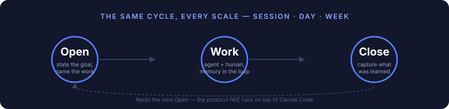

# IWE — Intellectual Work Environment

[](LICENSE)
[](CHANGELOG.md)
[-lightgrey.svg)]()



> The operating system for intellectual work. Your Knowledge. Your Experience. Your Environment — runs on top of any AI platform.
>
> **Repository type:** `Base/Formats` (FMT) — a template distribution. After forking, it becomes your personal environment with AI agents.

---

## The Problem

AI assistants can generate text, code, and answers. But most users face the same problems:

- **Context is lost.** Every new AI Session starts from scratch. Yesterday's decisions, plans, and agreements are forgotten.
- **Knowledge stays in your head.** You complete a course, read a book, solve a problem — but a month later you cannot reconstruct the reasoning.
- **AI replaces thinking instead of amplifying it.** You get an answer, but you do not become more competent. Without AI, you are back to zero.
- **No system.** Plans are in notes, tasks are in your head, Knowledge is in chat logs. Everything is scattered.
- **Time disappears.** It is unclear what you worked on, what you accomplished, or where you are heading.

---

## The Solution: An IDE, But for Thinking

**IWE (Intellectual Work Environment)** is an intellectual work environment.

Just as an IDE combines an editor, compiler, and debugger into one environment for a developer — IWE combines Knowledge, planning, and AI agents into one environment for thinking.

| IDE (for code) | IWE (for thinking) |
|----------------|-------------------|
| Editor → you write code | Exocortex → you capture Knowledge |
| Compiler → checks syntax | Principles → verify the correctness of decisions |
| Debugger → finds errors | Opening→Work→Closing Protocols → find Knowledge and context loss |
| Linter → improves quality | ArchGate → assesses architectural decisions |
| Git → change history | Strategist → work history and planning |

> **Core principle: exoskeleton, not prosthesis.** IWE amplifies your thinking — it does not replace it. After every Session you become more competent, not merely in possession of a result. See: [principles-vs-skills.md](docs/principles-vs-skills.md).

## Key IWE Terms

| Term | What it is |
|------|-----------|
| **Exocortex** | Your external Memory — files containing plans, context, and conclusions that Claude reads in every Session |
| **Pack** | A formalized Knowledge base for your Domain — the single source of truth for domain Knowledge |
| **Opening→Work→Closing** | A ritual for every Session and every day that prevents context loss |
| **ArchGate** | A structured Assessment of architectural decisions across 7 characteristics (instead of "I think this is fine") |
| **Strategist** | An AI agent that automatically drafts day/week plans and tracks Progress |
| **5 Repository Families** | The recommended structure for separating code, Knowledge, and data — see below |


### 5 Repository Families

The Exocortex is not a single Repository — it is a set of Repositories with clear boundaries: code, domain Knowledge, and personal data do not mix. `setup.sh` creates a minimal starting point (your own strategic Repository plus 3 base principles Repositories); additional Repositories are created as needed.

| Family | What it stores | Example name |
|--------|---------------|--------------|
| Base (`ZP`/`FPF`/`SPF`/`FMT-*`) | Platform principles and formats — delivered ready to use | `ZP`, `FPF` |
| `PACK-*` | Formalized domain Knowledge (source of truth) | `PACK-my-domain` |
| `DS-*` | Code, plans, courses — derived from Pack | `DS-strategy` |
| `PD-*` | Personal user data of a single type (no code) | `PD-persona`, `PD-metrics` |
| `MC-*` | Agent data (dialogues, service logs) — not read by a human day-to-day | `MC-sessions` |

Detailed data domain map and rationale: [ADR-004](docs/adr/ADR-004-data-domain-map.md).

---

## Work Culture — A New Way to Interact With AI


### The Opening→Work→Closing Protocol

Every Session and every day passes through three stages:

- **Opening** — Claude reviews the plan, identifies the task, and agrees on the approach. You do not start work from scratch — the AI knows the context.
- **Work** — as work proceeds, Claude captures valuable Knowledge (Capture-to-Pack). Insights are not lost.
- **Closing** — the result is recorded, the plan is updated, and the next Session starts where you left off.

Skipping Opening = unplanned work. Skipping Closing = lost result.

### Exocortex — External Memory

Your Knowledge, principles, Distinctions, plans, and context are stored in files that Claude reads in every Session. This is not a "prompt" — it is an **accumulated base** that grows with you.

### Knowledge Formalization (Pack)

What you learn does not stay in your head. Valuable Knowledge is formalized into a Pack — the Domain passport. Pack is the single source of truth for domain Knowledge. See: [LEARNING-PATH.md](docs/LEARNING-PATH.md).

---

## Who It Is For

Every professional drowns in information: 12+ tools (Notion, Google Docs, Slack, ChatGPT, courses...), Knowledge is spread thin, nothing is connected. AI answers questions but does not know *your* context — it starts from zero every time.

IWE is for those who want to change that:

- **Entrepreneurs and managers** — you strategize, make decisions, manage projects. IWE provides a system: from weekly planning to Domain Knowledge formalization.
- **Engineers and developers** — you work with code and Architecture. IWE preserves context between Sessions; the AI knows your codebase, technical debt, and Roadmap.
- **Researchers and analysts** — you study, synthesize, publish. IWE transforms scattered notes into a structured Knowledge base that grows with you.
- **Anyone doing intellectual work** — who wants **symbiosis with AI**, not dependence on it. An exoskeleton for thinking, not a prosthesis.

---

## Use Cases

### Work Projects

| Scenario | What happens | More |
|----------|-------------|------|
| **Product development** | Claude knows the Architecture, technical debt, and Roadmap. Every Session is a continuation, not a fresh start. | [SC.013](docs/use-cases/USE-CASES.md#sc013), [SC.015](docs/use-cases/USE-CASES.md#sc015) |
| **Documentation** | Knowledge is captured in Pack as work proceeds. No need to "write docs later" — they are written during the work. | [SC.004](docs/use-cases/USE-CASES.md#sc004), [SC.014](docs/use-cases/USE-CASES.md#sc014) |
| **Project coordination** | WeekPlan, DayPlan, Work Product Registry — the Strategist helps plan and track Progress. | [SC.001](docs/use-cases/USE-CASES.md#sc001), [SC.002](docs/use-cases/USE-CASES.md#sc002) |
| **Review and Refactoring** | ArchGate assesses decisions across 7 characteristics. Not "I think it's fine" — a structured Assessment. | [SC.015](docs/use-cases/USE-CASES.md#sc015) |

### Personal Development

| Scenario | What happens | More |
|----------|-------------|------|
| **Taking a course** | Claude helps capture key ideas, asks questions to verify Understanding, and connects new material to what you already know. | [SC.003](docs/use-cases/USE-CASES.md#sc003) |
| **Writing articles** | A creative Pipeline: note → draft → prepared piece → publication. Every Artifact is tracked. | [SC.005](docs/use-cases/USE-CASES.md#sc005) |
| **Strategizing** | Weekly Session: Review of the previous week, planning the new one, alignment with goals. The Strategist prepares the draft — you make the decisions. | [SC.011](docs/use-cases/USE-CASES.md#sc011) |
| **Building a Knowledge base** | Your Pack grows. After six months you have a formalized Domain Knowledge base, not a collection of notes. | [SC.014](docs/use-cases/USE-CASES.md#sc014) |

> Full catalog of 15 use cases: **[USE-CASES.md](docs/use-cases/USE-CASES.md)**

---

## What It Looks Like in Practice

- In the morning — the Strategist has drafted a plan: a Telegram notification plus a DayPlan file in the Repository.
- You open VS Code → `claude` → Claude knows the plan and suggests starting with the top Priority.
- You work — Claude captures Knowledge as you go (Capture-to-Pack).
- You close the Session — the result is recorded, the plan is updated.
- On Monday — the Strategist prepares a draft weekly plan; you discuss it in a strategizing Session.

---

## Machine Requirements

A minimum of **4 GiB of free RAM** is required while Claude Code (or another agent) runs on top of IWE. With less memory — especially on shared servers with multiple users — file read/write tools may intermittently fail with a message such as `PreToolUse hook did not respond before its timeout`. This message indicates insufficient host-process memory, not a broken template hook (issue [#461](https://github.com/iwesys/IWE/issues/461)) — `bash scripts/iwe-audit.sh` shows the current available memory level in the "Available Memory" section.

## Getting Started

**Quick start** (Git, Node.js, and Claude Code already installed): **[QUICK-START.md](docs/QUICK-START.md)** — 15 minutes to your first Session.

**Full setup** from a clean machine: **[SETUP-GUIDE.md](docs/SETUP-GUIDE.md)** — 30–60 minutes including all dependency installation.

**Not on macOS or not using Claude Code?** See **[PORTABILITY.md](docs/PORTABILITY.md)** — instructions for Kimi Code, Hermes Agent, and others.

**Different agent or LLM?** IWE is not tied to Claude. If your agent can see files in the repo folder and edit files, it will work. How to connect → [PORTABILITY.md](docs/PORTABILITY.md).

```bash
mkdir -p ~/IWE && cd ~/IWE
gh repo fork iwesys/IWE --clone
cd FMT-exocortex-template
bash setup.sh
```

After setup:

```bash
cd ~/IWE
claude
```

Tell Claude: **"Let's run the first strategic Session"** — and it will guide you through defining goals, creating your first plan, and configuring the Environment.

---

## Customization

IWE updates like a distribution — you receive Platform updates without losing your settings.

**Extensions (extensions/)** — add your own blocks to the Protocols:

```bash
# Add end-of-day reflection
echo "## Daily reflection
- What was difficult?
- What would I do differently?
- What deserves praise?" > extensions/day-close.after.md
```

**Parameters (params.yaml)** — enable or disable Protocol Steps:

```yaml
reflection_enabled: true    # Enable reflection
video_check: false          # Disable video check
multiplier_enabled: true    # IWE multiplier
```

**Updates** — `bash update.sh` updates the Platform while preserving your extensions/, params.yaml, and edits to CLAUDE.md (3-way merge).


---

## Documentation

| Document | Contents |
|----------|---------|
| **[Beginner's guide](docs/onboarding/onboarding-guide.md)** | Start here if you are new to IWE. What it is, why it exists, what it consists of — no technical jargon. |
| **[Quick start](docs/QUICK-START.md)** | 15 minutes from `git clone` to your first Session. For those who already have Git and Claude Code. |
| **[SETUP-GUIDE.md](docs/SETUP-GUIDE.md)** | Step-by-step setup from a clean machine. Requirements, modes (core/full), verification. |
| **[LEARNING-PATH.md](docs/LEARNING-PATH.md)** | IWE learning path: Architecture, principles, Protocols, Pack, Roles. |
| **[DATA-POLICY.md](docs/DATA-POLICY.md)** | Data policy: what is collected, where it is stored, how to delete it. |
| **[DATA-RESIDENCY.md](docs/DATA-RESIDENCY.md)** | Residency principle: data you bring into IWE from outside (health, calendar, working hours) — where it may and may not go. |
| **[IWE-HELP.md](docs/IWE-HELP.md)** | Quick reference and FAQ. |
| **[principles-vs-skills.md](docs/principles-vs-skills.md)** | Why principles matter more than Skills: the generative hierarchy. |
| **[CHANGELOG.md](CHANGELOG.md)** | Template change history. |

> Two documents cover adjacent topics: `DATA-POLICY.md` covers data the Platform collects about you; `DATA-RESIDENCY.md` covers data you bring into IWE from outside.

---

## FAQ

**Q: Is an Anthropic subscription required?**
A: For a full setup (Claude Code) — Claude Pro ($20/month) is recommended. If needed, you can upgrade to Claude Max (~$100/month) for unlimited usage. For the minimal setup (`setup.sh --core`) — works with any AI CLI. More: [SETUP-GUIDE.md](docs/SETUP-GUIDE.md).

**Q: Does it work with other AI systems (not Claude)?**
A: Yes, three agents are supported out of the box:
- **Claude Code** — full support: reads `CLAUDE.md`, all Skills and Hooks work.
- **Kimi Code** (VS Code) — reads `AGENTS.md` automatically when the repo is opened. Customization via `extensions/` or `AGENTS-agent-blocks.md`. Skills (`/day-open` etc.) via Claude Code.
- **Hermes Agent** — connect the aisystant MCP through Hermes settings and it receives instructions automatically.

For other agents (Cursor, Copilot, Gemini) adaptation is required. More: [PORTABILITY.md](docs/PORTABILITY.md).
The minimal setup (`setup.sh --core`) works without being tied to a specific agent.

**Q: Does it work on Linux/Windows?**
A: On macOS and Linux, standard scenarios work out of the box; Strategist automation uses launchd and systemd respectively, and the cloud option uses GitHub Actions. On Windows, individual parts have been tested through Git Bash with native Python (Strategist lock, #1030), but `session-guard.sh` and session opening require WSL2: in native Git Bash they fail immediately due to the Unix `fcntl` lock (#1032). Full IWE setup and updates on Windows remain untested — see: [SETUP-GUIDE.md](docs/SETUP-GUIDE.md) § Windows.

**Q: What if the computer is off or sleeping — will automation stop?**
A: Cloud Scheduler (GitHub Actions) runs in the cloud even when the computer is off. For local agents: Scripts automatically prevent sleep during operation (macOS: `caffeinate`, Linux: `systemd-inhibit`). For laptops, it is recommended to configure automatic wake and disable idle sleep — see [SETUP-GUIDE.md](docs/SETUP-GUIDE.md).

**Q: What is a Pack?**
A: A formalized Knowledge Domain — the single source of truth for domain Knowledge. More: [LEARNING-PATH.md](docs/LEARNING-PATH.md).

**Q: Is my data secure?**
A: Three protection zones: local, GitHub (private Repositories), Platform (per-user isolation). More: [DATA-POLICY.md](docs/DATA-POLICY.md).

**Q: How does IWE differ from Obsidian / Notion / Logseq?**
A: Obsidian is a notes store. IWE is a **work environment** with Protocols, AI agents, and Knowledge formalization. For notes, you can open a separate governance Repository (`DS-strategy`) in Obsidian — specifically that folder as a vault. The IWE root (`~/IWE`) is not supported as an Obsidian vault: it may contain very large Markdown files (for example, `FPF/FPF-Spec.md`) that cause Obsidian to show a blank screen. The entire workspace can be safely browsed in VS Code.

**Q: Is programming required?**
A: No. The template is a ready-made Configuration. Setup is via setup.sh. Work is done through Claude Code in natural language.

**Q: Can I use IWE without the Strategist?**
A: Yes. Claude Code + CLAUDE.md + memory/ work fully. The Strategist automates planning. Without it, you plan manually.

**Q: How do I set the strategizing day?**
A: In `memory/day-rhythm-config.yaml`, change `strategy_day: sunday` to the desired day. More: [LEARNING-PATH.md](docs/LEARNING-PATH.md).

**Q: The clone ended up in `~` instead of `~/IWE`?**
A: All setup commands must be run in the same terminal. If you opened a new one, it starts from `~`. Delete the folder from `~` and repeat starting with `cd ~/IWE`. More: [SETUP-GUIDE.md](docs/SETUP-GUIDE.md).


---

## IWE Community

IWE is an Environment you build alone. But you develop it together.

**The IWE community** is a closed chat for Practitioners who work within the same system: Opening→Work→Closing, Pack, Exocortex. A place where the discussion is not "how to prompt better" but how to build serious intellectual work.

### What Happens There

- **Work Product breakdowns** — participants share real Packs, plans, and Retrospectives. They receive feedback from people who understand what "Closing without recording the result" means.
- **IWE setup and customization Experience** — what broke, how it was fixed, which extensions proved useful.
- **Method discussions** — the Opening→Work→Closing fractal, ArchGate, Capture-to-Pack in Practice: what works, where theory diverges from reality.
- **Links and finds** — tools, patterns, SOTA that fit the IWE philosophy.

### Why This Matters

You can study the system alone. But most questions arise during application: "How do I formalize this Knowledge Domain?", "Am I using Opening→Work→Closing correctly?", "Who has Experience with this tool?"

In the community, these questions are answered by people who have already been through it.

### Free Channels

- [GitHub Discussions](https://github.com/iwesys/IWE/discussions) — questions, ideas, share your setup.
- [Issues](https://github.com/iwesys/IWE/issues) — bug reports and feature requests.

### Closed Community (Telegram)

Deep Practice, Work Product breakdowns, direct support. Entry is through the **"IWE for Practitioners"** seminar (5000₽) via the [@aist_me_bot](https://t.me/aist_me_bot) bot.

---

## Contributing

See [CONTRIBUTING.md](CONTRIBUTING.md) — how to help the project.

**IWE team developers (level T4+):** the single entry point is [Getting started as a developer](docs/developer/). In 10 minutes you will understand the development Pipeline (6 stations, dual output) and complete your first task.

---

## License

MIT