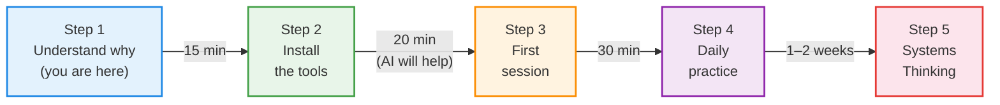
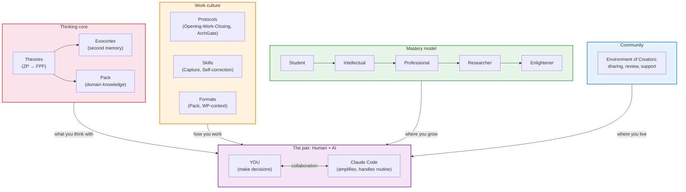
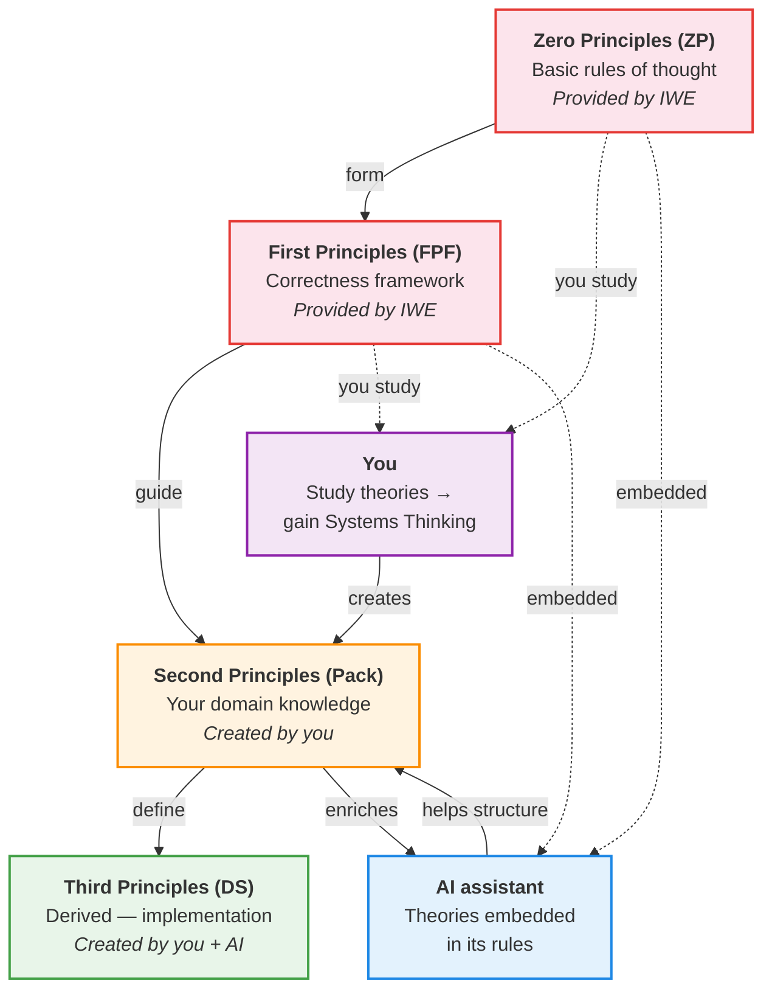

# IWE for Beginners: The Operating System for Intellectual Work

> **Where to start:** want to act immediately → [QUICK-START.md](../QUICK-START.md) (15 minutes). Working through a browser (claude.ai), without VS Code → [BROWSER-CI-TEMPLATE.md](../BROWSER-CI-TEMPLATE.md). This file is a conceptual introduction: what IWE is and why you need it.

> **Who this is for:** Anyone encountering IWE for the first time who does not know what GitHub, VS Code, or the command line are. That is fine. You are in the right place.
>
> **What you will get:** An Understanding of what IWE is, what it consists of, why it exists — and how to get started without being a programmer.

---

## 1. Your Problem (And It Is Real)

Do you recognize yourself?

**Knowledge gets lost.** You read a book, attend a lecture, take notes — and a month later you cannot find that one idea. Or you find it, but cannot remember the context. Notes in Notion, a notebook, your phone, on a napkin — everywhere and nowhere.

**Plans do not work.** You make a plan for the week, and by Wednesday it is already obsolete. New tasks push out old ones. No priority system, no Review — only the feeling that you never have enough time.

**AI does not really help.** You tried ChatGPT or Claude — you got polished but generic answers. Every time you start from scratch. The AI knows nothing about you: not your projects, not your goals, not what you have already tried.

---

## 2. How IWE Solves This

IWE — **Intellectual Work Environment** — is the operating system for intellectual work. Just as Ubuntu is not simply a collection of programs but a distribution (kernel + packages + Configuration + community), IWE is a methodology + a ready-made Environment + ongoing support.

### Four Components of IWE

```
IWE — the operating system for intellectual work

  Thinking core      — what you think with (theories, principles, distinctions)
  Work culture       — how you work (protocols, skills, formats)
  Mastery model      — where you grow (from Student to Enlightener)
  Community          — where you live (an environment of Creators)
```

**Important:** IWE is a tool. But behind the tool stand theories (Systems Thinking, management, engineering) and a work culture (14 elements: protocols, skills, formats). Without theories, the tool remains a notebook with AI. With theories, it becomes an exoskeleton for thought.

### How the Components Solve Each Problem

| Problem | IWE Component | How It Works |
|---------|--------------|-------------|
| Knowledge gets lost | **Thinking core** (exocortex + Pack) | Every unit of Knowledge has its place. AI helps retrieve and structure it. Change history is stored in GitHub |
| Plans do not work | **Work culture** (Opening-Work-Closing rituals + Claude Code) | Morning — daily plan (automatic). Evening — results. Every week — Review. AI prevents unfinished items from being forgotten |
| AI does not help | **Thinking core + work culture** | AI reads YOUR files, knows YOUR goals, remembers YOUR history. This is a personal assistant, not an anonymous chatbot |
| I do not know where to grow | **Mastery model** | A clear Trajectory: from beginner to expert. Each Mastery stage — concrete Skills and results |
| Facing problems alone | **Community** | An environment of Creators: sharing Experience, Review, support |

> More on each scenario: [Daily Planning](https://github.com/TserenTserenov/PACK-digital-platform/blob/main/pack/digital-platform/08-service-clauses/DP.SC.001-daily-planning.md) | [Weekly Planning](https://github.com/TserenTserenov/PACK-digital-platform/blob/main/pack/digital-platform/08-service-clauses/DP.SC.002-weekly-planning.md) | [Learning and Development](https://github.com/TserenTserenov/PACK-digital-platform/blob/main/pack/digital-platform/08-service-clauses/DP.SC.003-learning-and-development.md) | [Knowledge Capture](https://github.com/TserenTserenov/PACK-digital-platform/blob/main/pack/digital-platform/08-service-clauses/DP.SC.004-knowledge-capture.md)

---

## 3. Your Path: From Zero to a Working IWE



### Step 1. Understand Why (You Are Already Here)

You are reading this document — that means the first Step is done. You understand that your current way of working with information does not scale. That is an important realization.

### Step 2. Install the Tools (~20 minutes)

You do **not** need to understand programming. Installing IWE is three actions:

1. Install Claude Code (free)
2. Create a GitHub account (free)
3. Run one command that configures everything else

> **AI will help.** If you have already installed Claude Code — just tell it: "Help me install IWE." It will walk you through every Step.
>
> Detailed instructions: [SETUP-GUIDE.md](../SETUP-GUIDE.md)

**What you need (minimum):**
- A computer (Mac, Linux, or Windows with WSL)
- A Claude Pro subscription (~$20/month) — for Claude Code
- A GitHub account (free)

### Step 3. First Strategic Session (~30 minutes)

After installation, you launch Claude Code and run your first Session:
- You fill in a strategic document (who you are, what matters, where you are headed)
- You define 3–5 Work Products (tasks) for the coming week
- AI structures this into a plan

This is not an abstract exercise — you get a working plan immediately.

> More detail: [SETUP-GUIDE.md, stage 2](../SETUP-GUIDE.md)

### Step 4. Daily Practice (1–2 weeks)

Every day follows the same rhythm:
- **Morning:** "Open the day" → Claude shows the plan, events, where you left off
- **Work:** You work, capturing conclusions at Work milestones
- **Evening:** "Close the day" → Claude records results, updates plans

After a week you will feel the difference: nothing is lost, everything is in its place.

> More detail: [LEARNING-PATH.md, §5 — Everyday Work](../LEARNING-PATH.md)

### Step 5. Systems Thinking (When You Are Ready)

After 1–2 weeks of Practice you will notice that IWE is more than tools. It is built on specific principles. Mastering those principles is the next level. See [section 6](#6-iwe-map-what-is-inside) for details.

> Wondering what will happen to your settings when IWE updates? → [Three Layers of IWE](architecture-layers.md) — a short explanation of what updates automatically and what stays yours permanently.

---

## 4. Do Not Be Afraid

### "I Am Not a Programmer"

You do not need to be. IWE is an operating system for intellectual work, not for programming. You write texts, plans, notes. GitHub is simply reliable storage. You will not write code.

### "GitHub, CLI, Terminal — That Sounds Scary"

Only the first time. Here is what you actually need to know:
- **GitHub** — a place where files are stored (like Google Drive, but with history)
- **Terminal** — a window where you type commands as text (Claude Code will tell you what to type)
- **CLI** — simply a way of communicating with your computer through text instead of buttons

After installation, you will interact primarily with Claude Code — in plain language.

### "This System Is Too Complex"

IWE is not a monolith you need to master all at once. It is a modular OS. The **IWE onboarding path** — you add Components to your Environment as you need them:

| Stage | What you add | What you get |
|-------|-------------|-------------|
| **Stage 1 — Start** | Claude Code + exocortex | A personal AI assistant that remembers you |
| **Stage 2 — Rituals** | + Opening-Work-Closing + daily plan | Structured work without losing context |
| **Stage 3 — Knowledge base** | + Pack + bot | A knowledge base + mobile access |
| **Stage 4 — Automation** | + roles + agents | AI agents that work independently |

> **Stages = what you physically configure in your Environment** (not a Mastery stage or access tier). Do not confuse: "Steps 1–4" above = the order of first introduction; Platform access tiers (T0→T4) → [DP.ARCH.002]; Development stage (cp-profile) → FORM.089. More on access tiers: [LEARNING-PATH.md, §9](../LEARNING-PATH.md).

### "Will AI Do Everything for Me?"

No. And that is fundamental. IWE is an **exoskeleton, not a prosthesis**.

- A **prosthesis** replaces a capability. You stop thinking because AI thinks for you.
- An **exoskeleton** extends a capability. It is a partner that lives on your laptop, your phone, in a robot. You think better because AI takes on the routine: it reminds, structures, finds connections.

Your thinking is the primary resource. AI helps you not waste it searching for a file or reconstructing context.

> More detail: [Principles vs Skills](../principles-vs-skills.md)

---

## 5. Four Components in Detail

### Thinking Core — What You Think With

IWE is grounded in specific **theories**: Systems Thinking, management, enterprise engineering, methodology. These theories are organized into a hierarchy of principles (ZP → FPF → Pack → DS) and embedded in the AI assistant's rules. See [section 7](#7-theories-and-work-culture--the-foundation-of-iwe) for details.

**Exocortex** — your second Memory. A set of files that the AI assistant (Claude Code) reads and updates. When you start work, it knows where you left off yesterday. When you finish, it records your conclusions. You no longer lose context between Sessions.

**Pack** — a Knowledge base for your Domain. If you are studying, say, marketing — your summaries, rules, and Distinctions accumulate in a Pack. This is not a folder of bookmarks but a structured library where every unit of Knowledge has its place.

### Work Culture — How You Work

Work culture is not an abstract value. It is **14 concrete elements** divided into three types:

| Type | What It Is | Examples |
|------|-----------|---------|
| **Protocols** | Formalized sequences (you follow Steps) | Opening-Work-Closing, ArchGate, Day Open/Close |
| **Skills** | What you develop (applied by situation) | Capture, Self-correction, Distinctions |
| **Formats** | How you present results (to a standard) | Pack structure, WP-context, Collapsible sections |

**Opening-Work-Closing rituals** — the main Protocol. A simple pattern that repeats at every scale. You start the day — Opening (what am I doing today?). You work — Work (capturing Knowledge at milestones). You finish — Closing (what did I do, what is next?).

### Mastery Model — Where You Grow

A clear Trajectory from beginner to expert. Each Mastery stage has concrete Skills and results. You always know where you are and what to develop next.

### Community — Where You Live

An environment of Creators: sharing Experience, Review, support. Not a Q&A forum, but a place where culture and meaning are shaped.

### You + Claude Code = A Pair

At the center of IWE is **you**. You make decisions, think, direct. Claude Code is your Peer partner: it amplifies, structures, takes on the routine. But decisions are always yours.

### Tools (Delivery Mechanisms)

Tools are not IWE. They are the **delivery mechanisms** for the four Components:

**Claude Code** — an AI assistant that works directly in the terminal. It does not just answer questions — it reads your files, helps you plan, reminds you about unfinished work. It is your Peer partner, not a search engine.

**GitHub** — cloud storage with a complete change history. You can always return to any version of any file.

**VS Code** — a free editor. Not needed at the start — Claude Code works in the terminal. VS Code becomes useful later, when you want to browse files on your own.

**Bot @aist_me_bot** — a Telegram assistant. It answers questions from your Knowledge base and reminds you about tasks. You do not need to open your computer to stay connected to IWE.

More on theories — in the [following sections](#6-iwe-map-what-is-inside).

---

## 6. IWE Map: What Is Inside

Now that you understand why each Component exists — here is how they connect:



**Four components — and you at the center:**

| Component | What It Is | Simple Analogy |
|-----------|-----------|---------------|
| **Thinking core** | Theories + exocortex + Pack. The foundation everything is built on | Operating system (Linux kernel) |
| **Work culture** | Protocols, Skills, Formats — 14 elements | Standard utilities (ls, grep, git) |
| **Mastery model** | Trajectory from beginner to expert | Package manager (apt install) |
| **Community** | Environment of Creators: sharing, Review, support | Forum + repositories (GitHub community) |

> **Tools** (Claude Code, VS Code, GitHub, bot) are the delivery mechanisms. Like the hardware the OS runs on.

---

## 7. Theories and Work Culture — The Foundation of IWE

You can install all the tools, configure the rituals, and start keeping plans — and still not get the most out of IWE. Why?

Because **IWE is a tool, but behind the tool stand theories and work culture**. Without them, the tool remains a notebook with AI.

### Theories: Where the Principles Come From

IWE is grounded in a body of theories taught in the courses at the [Engineer-Manager Workshop](https://system-school.ru/):
- **Systems Thinking** — seeing the whole, not only the parts
- **Methodology** — Distinctions, method descriptions, Work Products
- **Enterprise engineering** — how organizations and projects are structured
- **Management** — leadership, governance, strategizing

These theories are organized into a hierarchy of principles:



| Level | Who creates | Who uses | Example |
|-------|-------------|---------|---------|
| **Zero (ZP)** | IWE | You + AI | Basic rules of thought |
| **First (FPF)** | IWE | You + AI | Correctness framework, Distinctions |
| **Second (Pack)** | You | You + AI | Your Knowledge in marketing, management, engineering |
| **Third (DS)** | You + AI | You + AI | Specific plans, code, processes |

### Work Culture: 14 Elements

Work culture is the second Component of IWE. It is not "motivation" or "habits." It is a **designed set of methods** divided into three types:

| Type | What It Is | Examples | How It Is Learned |
|------|-----------|---------|------------------|
| **Protocols** | You follow Steps (formalized) | Opening-Work-Closing, ArchGate, Day Open/Close | Follow the instruction → it becomes automatic |
| **Skills** | You apply by situation (developed through Practice) | Capture, Self-correction, Distinctions | Practice → feedback → Mastery |
| **Formats** | You present to a standard | Pack structure, WP-context | Use the Template → it becomes habit |

Work culture is what people pay for. A tool can be copied, theories can be read. But an established work culture is the result of Practice that cannot be skipped.

### What Systems Thinking Is (In Plain Terms)

It is the **result** of studying theories and applying work culture. The ability to see the **whole**, not only the parts:

- You plan a week. Without Systems Thinking — a list of tasks. With it — an Understanding of which tasks are connected, which one blocks another, what matters more strategically.
- You read a book. Without Systems Thinking — a transcript of quotes. With it — Distinctions and principles you can apply in different contexts.
- You use AI. Without Systems Thinking — random questions. With it — precise requests, because you understand the structure of your own work.

### Why IWE Will Not Fully Open Without This

IWE uses specific concepts from its theories:

| Concept | Source theory | Where in IWE | What it means |
|---------|--------------|-------------|--------------|
| **Distinctions** | Methodology | Pack, exocortex | Precisely defining how one thing differs from another |
| **Method descriptions** | Methodology | Opening-Work-Closing rituals | Understanding "how," not only "what" |
| **Work Products** | Systems engineering | Planning, Review | Focus on results, not on activities |
| **Roles** | Management | Strategist, Extractor | Separation: who does what (including AI) |

You can start using IWE **without** a deep Understanding of these concepts. But to truly unlock its potential — it is worth studying them. And the more you learn, the smarter your AI Peer partner becomes, because you fill the Pack with Knowledge.

### How to Start Learning

1. **First week:** Simply use IWE. Get comfortable with the Opening-Work-Closing rituals. Do not go deep into theory yet.
2. **Second week:** Read [Principles vs Skills](../principles-vs-skills.md) — a 10-minute introduction to the philosophy of IWE.
3. **Beyond that:** Study [LEARNING-PATH.md, §3 — Foundation of Thinking](../LEARNING-PATH.md) at your own pace. The bot @aist_me_bot will help with questions.

> Recommended courses: [Engineer-Manager Workshop](https://system-school.ru/) — the courses whose theories IWE is built on. Start with: "Systemic Self-Development," "Systems Thinking," "Methodology."

---

## Links and Resources

### Start Now

| Resource | What It Is | Link |
|----------|-----------|------|
| Step-by-step installation | 7 stages, from zero to a working IWE | [SETUP-GUIDE.md](../SETUP-GUIDE.md) |
| Learning path | Full mastery program (11 sections) | [LEARNING-PATH.md](../LEARNING-PATH.md) |
| Quick reference | FAQ + 4-day plan | [LEARNING-PATH.md, §11](../LEARNING-PATH.md) |

### Go Deeper

| Resource | What It Is | Link |
|----------|-----------|------|
| What IWE is | Core definition, Architecture, perimeters | [DP.IWE.001](https://github.com/TserenTserenov/PACK-digital-platform/blob/main/pack/digital-platform/02-domain-entities/DP.IWE.001-intelligent-working-environment.md) |
| Template and setup | Components, Roles, FAQ | [DP.IWE.002](https://github.com/TserenTserenov/PACK-digital-platform/blob/main/pack/digital-platform/02-domain-entities/DP.IWE.002-iwe-template-and-setup.md) |
| Principles vs Skills | Why principles matter more than tools | [principles-vs-skills.md](../principles-vs-skills.md) |

### Usage Scenarios

| Scenario | Promise | Link |
|----------|---------|------|
| Daily planning | DayPlan by 08:00 with priorities and context | [DP.SC.001](https://github.com/TserenTserenov/PACK-digital-platform/blob/main/pack/digital-platform/08-service-clauses/DP.SC.001-daily-planning.md) |
| Weekly planning | WeekPlan (with a "Results W{N}" section) | [DP.SC.002](https://github.com/TserenTserenov/PACK-digital-platform/blob/main/pack/digital-platform/08-service-clauses/DP.SC.002-weekly-planning.md) |
| Learning and development | Q&A, homework review, marathons | [DP.SC.003](https://github.com/TserenTserenov/PACK-digital-platform/blob/main/pack/digital-platform/08-service-clauses/DP.SC.003-learning-and-development.md) |
| Knowledge capture | Fleeting notes → Pack | [DP.SC.004](https://github.com/TserenTserenov/PACK-digital-platform/blob/main/pack/digital-platform/08-service-clauses/DP.SC.004-knowledge-capture.md) |

### Compatibility and Cost

| Parameter | Value |
|-----------|-------|
| OS | macOS, Linux, Windows (via WSL) |
| Required subscription | Claude Pro (~$20/month) |
| GitHub | Free |
| VS Code | Free (needed later, not at the start) |
| Programming knowledge required | No |

> More detail: [PLATFORM-COMPAT.md](../PLATFORM-COMPAT.md) | [FAQ in DP.IWE.002, §11](https://github.com/TserenTserenov/PACK-digital-platform/blob/main/pack/digital-platform/02-domain-entities/DP.IWE.002-iwe-template-and-setup.md)

---

*Created: 2026-03-17 | Updated: 2026-03-27 | WP-120 | [FMT-exocortex-template](https://github.com/TserenTserenov/FMT-exocortex-template)*